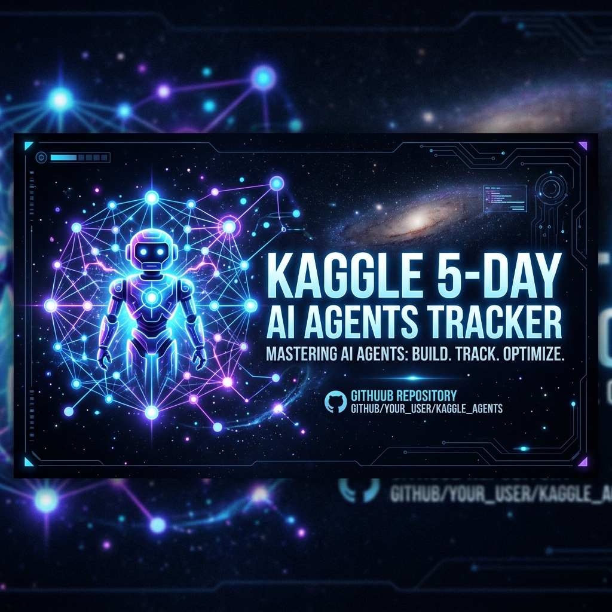

<div align="center">
  
  
  <br />
  <br />

  <h1>🚀 Kaggle 5-Day AI Agents Tracker</h1>
  
  <p>
    <b>A modern, interactive, and engaging progress tracker for the Kaggle 5-Day AI Agents intensive vibe coding course.</b>
  </p>

  <p>
    
    
    
    
  </p>
</div>

## 📌 Overview

This project is a React-based web application designed to help learners track their progress through the Kaggle 5-Day AI Agents course. It features:

- **State Persistence:** Your progress is automatically saved to LocalStorage, ensuring you never lose track of where you left off.
- **Motivational Highlights:** Achieve milestones as you progress through each day's modules.
- **Modern UI:** Built with React, Tailwind CSS v4, and Lucide Icons for a beautiful, responsive, and intuitive user experience.
- **Engaging Animations:** Uses `motion` to add satisfying interactions and state transitions.

## 🛠️ Technology Stack

- **Framework:** [React 19](https://react.dev/) + [Vite](https://vitejs.dev/)
- **Styling:** [Tailwind CSS v4](https://tailwindcss.com/)
- **Icons:** [Lucide React](https://lucide.dev/)
- **Animations:** [Motion](https://motion.dev/)
- **Language:** TypeScript

## 🚀 Run Locally

**Prerequisites:** [Node.js](https://nodejs.org/) installed on your machine.

1. **Install dependencies:**
   ```bash
   npm install
   ```

2. **Run the development server:**
   ```bash
   npm run dev
   ```

3. **Open the app:**
   Open [http://localhost:3000](http://localhost:3000) in your browser.

## 📂 Project Structure

- `src/App.tsx`: Main application component containing the layout and logic.
- `src/data.ts`: Course curriculum and module definitions.
- `src/types.ts`: TypeScript interfaces for the tracker data structures.
- `src/components/`: Reusable UI components.

## 📄 License

This project is open-source and available under the MIT License.
